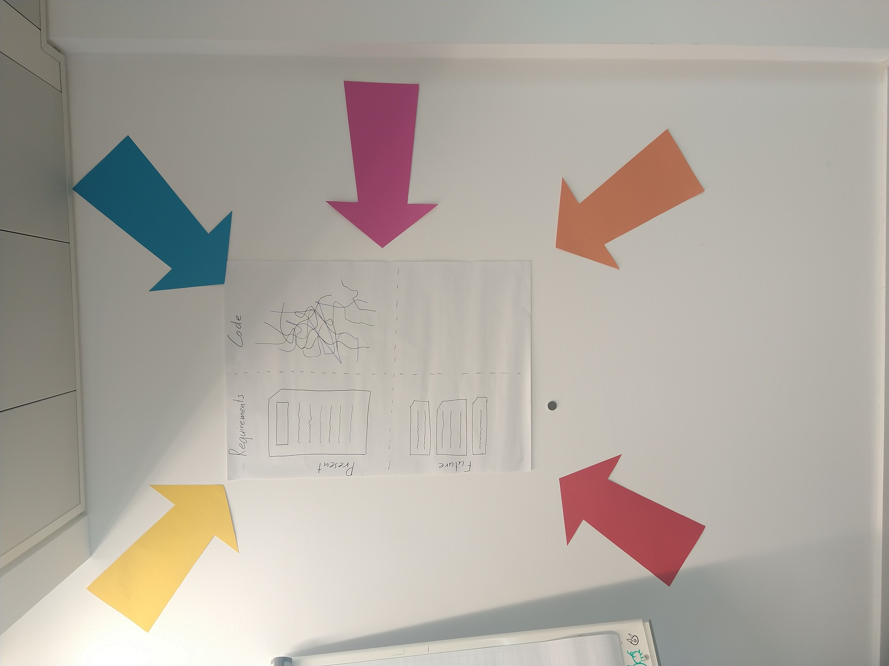
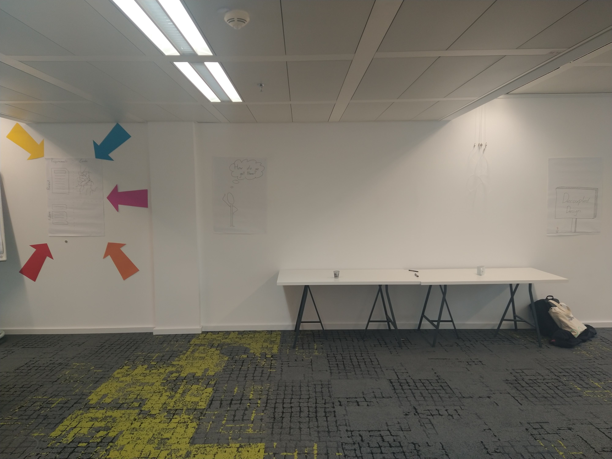
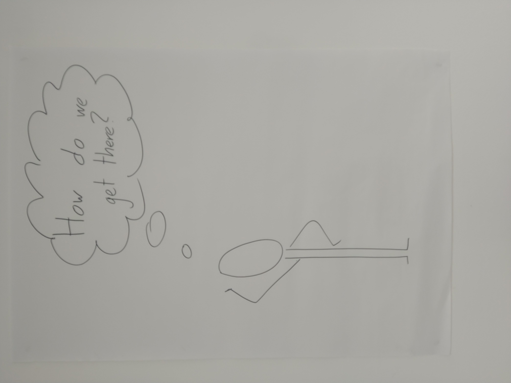
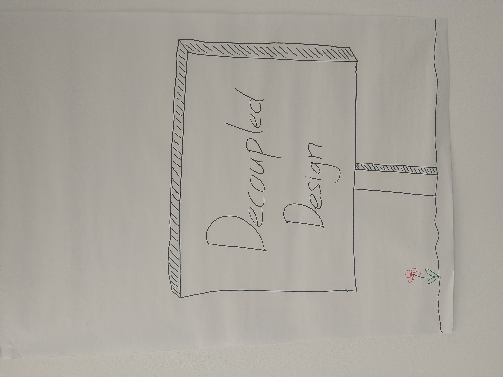
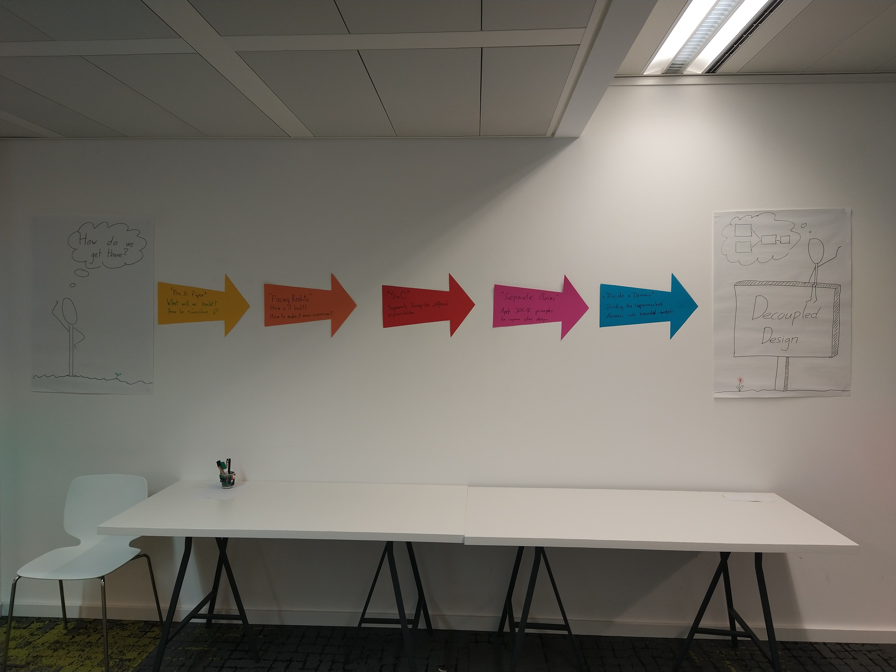

# Big Picture

*Copy-paste aus [Diskussion](https://github.com/swkWien/sessions/issues/100) und dem was am Tag passiert ist.*

## Ausgangslage und unser Zugang

* Requirements (links oben)
* Code Base (rechts oben)
* Feature Requests (links unten)
  [Die Feature Requests sind der dahinter liegende Grund, warum für uns überhaupt für Design interessieren.]
* Fiktive Code Base die alle neuen Features enthält (rechts unten)

**Die zu Grunde liegende Frage**

> Wie komme ich zur dieser fikitven Code base?

Naja...
* Das ist in der Praxis nicht so einfach.
* Kopplung ist ein Problem.
* Wie lösen wir das Problem?
* Decoupling!
* Aber wie machen wir das?
* Das ist das Thema unseres Retreats. :point_left:

**Die Methode des Coderetreats:**

> Approach the same problem repeatedly from different angles [Pfeile]

*Wir wissen natürlich, was unser Zugang ist, die Teilnehmenden wissen es an dieser Stelle noch nicht.*

## Strategien und Evolution

Jede Session ist einem Thema gewidmet. Sagen wir einer **Strategy to decouple**.

Diese Pfeile weisen den Weg, einer nach dem anderen. Diesen Weg gehen wir, er führt uns Richtung **Decoupled Design**.

*Wir können auch tatsächlich die Pfeile nehmen und von links nach rechts wandern lassen, sodass sie dann rechts die Abfolge bilden, von der wir sprechen.*

Die Pfeile könnten heißen:
* Understand requirements and domain
* Clean code
* Separate concerns
* Separate classes
* Separate domains (functional areas) / modules

Es gibt Verschränkungen/Überlappungen zwischen dein Pfeilen.

---

Disclaimer:
* Das ist eine Moderationshilfe mit dem Ziel, den Tag greifbarer zu machen
* Moderationshilfe != Schematische Darstellung der Method(en)
* Ausgangslage, Ideen, Methoden, Lösungen sind unterschiedliche Dinge
