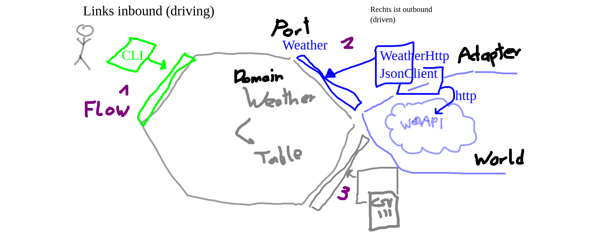

# Overhead Coderetreat 2022-09-16

## Schedule

- 08:45 - 09:00 Welcome
- 09:00 - 09:15 Check-in
- 09:15 - 09:45 Topics
- 09:45 - 10:55 Session 1 - 1h
- 10:55 - 11:05 Small Break
- 11:30 - 12:40 Session 2 - 1h
- 12:40 - 13:40 Lunch Break
- 13:40 - 14:30 Session 3 - 1h
- 14:30 - 15:00 Closing Retro

## Friendly Reminder

Recall coding dojo mindset and rules of engagement.

## Check-in

How are you today? Wie bin ich da?

- Rea: verschlafen
- Claus: erstaunlich motiviert
- Gregor: durcheinander, im Stress
- Peter: inspiriert von Agile Tour [https://agiletourvienna.at/](https://agiletourvienna.at/)

### Learning Opportunities

- Agile Tour [https://agiletourvienna.at/
](https://agiletourvienna.at/)
- PyWeek [https://pyweek.org/](https://pyweek.org/) (bi-annual game jam)
- Socrates Day 2022 VIE [https://www.meetup.com/squer-brainfood-talks/events/288451266/](https://www.meetup.com/squer-brainfood-talks/events/288451266/)
- GDCR
   - Local global (WIP in Arbeit Nagarro)
   - Continuous global (wird Eventbrite events geben)

## Possible Topics

Add your suggestions for topics here.

- New constraint: Replace words with letter "E" (Peter): Whenever a name has an "e" in it, you need to find another reasonable name without an "e". Names should still be clean and meaningful. This is a practice on finding names and synonyms.

- New TDD kata practicing string manipulation in a data transformation pipeline [https://github.com/nickdelgrosso/dna-transcription-kata](https://github.com/nickdelgrosso/dna-transcription-kata) (Peter)

- | New Refactoring Kata [https://github.com/emilybache/Necklace-Refactoring-Kata](https://github.com/emilybache/Necklace-Refactoring-Kata) in Java, Python, TypeScript (Peter) - focus in design pattern Chain of Responsibility

- | Refactoring Kata [https://github.com/martinsson/Refactoring-Kata-Lift-Pass-Pricing](https://github.com/martinsson/Refactoring-Kata-Lift-Pass-Pricing). Is a small Transaction script. Start with Tests and isolate application- from infrastructure-code in your preferred way. FP and/or Functional Core/Imperative Shell and/or Hexagonal and/or Tactical DDD or Freestyle? choose your Flavor and present the result. (Gregor)

- Mob Programming RPG (Gregor) [http://gregorriegler.com/mob-programming-rpg](http://gregorriegler.com/mob-programming-rpg) (weniger Coding, man spielt ein Spiel und versucht sich an die Rollen zu halten) [https://github.com/gregorriegler/mob-programming-rpg](https://github.com/gregorriegler/mob-programming-rpg), [https://github.com/willemlarsen/mobprogrammingrpg](https://github.com/willemlarsen/mobprogrammingrpg)

- ||| Design/ TDD Hexagonal Architecture / Ports and Adapter Kata [https://github.com/swkBerlin/ports-and-adapters](https://github.com/swkBerlin/ports-and-adapters) (The link to Allistair Cockborns article is dead but we can go back in time [http://web.archive.org/web/20180821070937/http://alistair.cockburn.us/Hexagonal+architecture](http://web.archive.org/web/20180821070937/http://alistair.cockburn.us/Hexagonal+architecture)) I came across it when searching "hexagonal" katas (in light of the GDCR discussion). You start from scratch. (Claus). Neuer Artikel [https://alistaircockburn.com/Articles/Component-Strategy-generalizes-Ports-Adapters](https://alistaircockburn.com/Articles/Component-Strategy-generalizes-Ports-Adapters#wbb1)

- ||| Yatzy Refactoring Kata [https://github.com/emilybache/Yatzy-Refactoring-Kata/](https://github.com/emilybache/Yatzy-Refactoring-Kata/tree/main/python). Refactor to FP (or two phases, one OO refactoring and then refactor that one to FP). I came across it when searching for "FP" katas (demo by Victor Rentea) (Claus) Could also be two sessions, one FP and one OO starting from scratch and comparing solutions (Peter)

- | Test Recycling to allow for smaller functional increments. Same idea as last time not focus on smallest possible step but useful functional steps (that's what I intended to do originally;) (Claus)

- || ArchUnit ausprobieren (Rea) [https://github.com/TNG/ArchUnit-Examples](https://github.com/TNG/ArchUnit-Examples)

- neue TDD Kata Langton's Ant (Rea) [https://en.wikipedia.org/wiki/Langton%27s\_ant](https://en.wikipedia.org/wiki/Langton%27s_ant)

If we do an ensemble, we are explicit about responsibilities.

### Session 1 Yatzi - refactor auf FP

Yatzy Refactoring Kata [https://github.com/emilybache/Yatzy-Refactoring-Kata/](https://github.com/emilybache/Yatzy-Refactoring-Kata/tree/main/python). Refactor to FP (or two phases, one OO refactoring and then refactor that one to FP). I came across it when searching for "FP" katas. Could also be two sessions, one FP and one OO starting from scratch and comparing solutions.

Übung mit FP Paradigmen: kleine (max 3 LoC) Funktionen mit 1 Eingabe Parameter, kein State, keine Klassen

- Ziel war score(method\_for\_category, roll) bzw. score(roll)(method) od. score(method)(roll)

Cyberdojo, Python, unit test, Ensemble rotieren Lust-basiert [https://cyber-dojo.org/kata/edit/lMWc2g](https://cyber-dojo.org/kata/edit/lMWc2g)

Augen eines Würfels = dot oder pip

**What did we do and learn?**

- Closure vs. Function
- Experimente wie man auf 1 Parameter kommt
  - War interessant zu sehen auf unterschiedliche Methoden auf einen Parameter zu kommen.
  - Varianten: partial application, closure; unterschiedliche Parameter
- Gibt keinen State Change, daher vielleicht kein großer Unterschied zur OO Variante
- Python Procedural comprehension mit Bedingung
- Yatzy ist nicht so grosse Herausforderung für FP, weil nur einfacher State.
  - Für Anfänger geeignet weil eben nicht so schwer ist. Ich muss nur den State = Roll herumreichen.
    Die Häflte geht ganz leicht.
    Aber nicht ganz dumm ohne State. Ist gut.

### Session 2+3: Design/ TDD Hexagonal Architecture / Ports and Adapter Kata

[Cyberdojo](https://cyber-dojo.org/kata/edit/fJazkv), Python, unit test, Ensemble rotieren Lust-basiert [https://cyber-dojo.org/kata/edit/fJazkv](https://cyber-dojo.org/kata/edit/fJazkv)

Design/ TDD Hexagonal Architecture / Ports and Adapter Kata [https://github.com/swkBerlin/ports-and-adapters](https://github.com/swkBerlin/ports-and-adapters) (The link to Allistair Cockborns article is dead but we can go back in time [http://web.archive.org/web/20180821070937/http://alistair.cockburn.us/Hexagonal+architecture](http://web.archive.org/web/20180821070937/http://alistair.cockburn.us/Hexagonal+architecture)) I came across it when searching "hexagonal" katas (in light of the GDCR discussion). You start from scratch. Neuer Artikel [https://alistaircockburn.com/Articles/Component-Strategy-generalizes-Ports-Adapters](https://alistaircockburn.com/Articles/Component-Strategy-generalizes-Ports-Adapters#wbb1)

- Test mit Wishful thinking um das API des Adapters zu "erfinden" = Test Driven Design
- Wir machen Bottom Up, d.h. fangen mit hinterem API an

**What did we do and learn?**

- Beispiel https://github.com/swkBerlin/ports-and-adapters
  - Beispiel hat alle Arten von Ports.
  - Beispiel scheint ein gutes Beispiel zu sein
  - trotz wenig Spezifikation ist viel passiert
- Ports & Adapters
  - Driving ports (inbound, input to steer system, e.g. user facing)
  - Driven ports (outbound, from domain to outside world (API, file system, ...))
  - Port (Interface), Adapter(extends Interface) ist konkrete Implementierung
  - nach Alister sollte Inbound symmetrisch sein zu Outbound
- Python: ABC
- Cyberdojo geht auch für anspruchsvollere Sachen
  - hat Tools&Shortcuts: Alt-Maus = Colum Selection
  - Ctrl-Shift-R = Suchen/ersetzen
  - Shift-Tab = formatieren (aber zerstört Python)
  - kein Internetzugriff, aber auf Platte schreiben
- Design by wishful thinking
- Was ist ein Test? Was ist Feedback? Was ist compile?
- Diskussion Outside-in/bottom-up? Klar oder doch nicht?

## Final Retro

**About the day as a whole.**

- Alle drei Sessions sehr interessant und viel mitgenommen, das noch verarbeitet werden möchte
- Intensiv und sehr produktiv; Pad okay, Whiteboard zu ersetzen
- heute einiges gemacht, gute Zusammenarbeit, viel Output. toll dass es stattgefunden hat.
- Produktiv, keine langen (unnötigen) Diskussionen, manches bissal zu langsam
- How did the pad work for you? (Why is it rich text and not markdown?) WHiteboard keine gute Lösung, Dokument ist okay. Try cocreate next time.
- zeitweise war es mir zu langsam, nebenbei noch etwas anderes gemacht...
