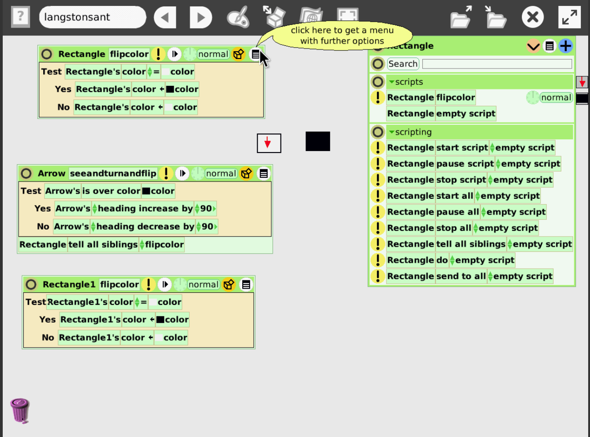

# Zero Overhead Code Retreat

## Market Place

Kata: Langston's Ant
* Requirements Change
* Multisensorisches Feedback?

Constraint/Method: Interactive Programming

Fun:
* Welche Sprache ist am spaßigsten?
* Welches Kata ist am spaßigsten?
* Welches Constraint ist am spaßigsten?

Neu: Neue Sprache
* Kann man an einem Tag eine Sprache lernen?

## Session 1: Langston's Ant Interactive Programming

XP practices (vs?) TDD

Kontinuierliche Visualisierung, damit man gleich sieht, was das Programm macht

Im Programm State ändern? Hot Reload?

## Session 2: Langston's Ant Interactive Programming II

https://squeak.js.org/etoys/

